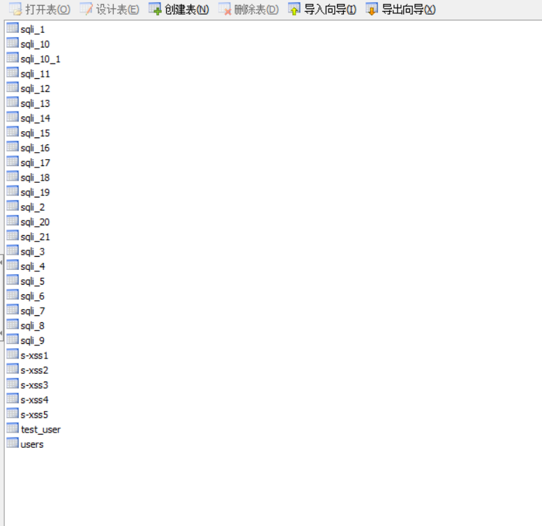
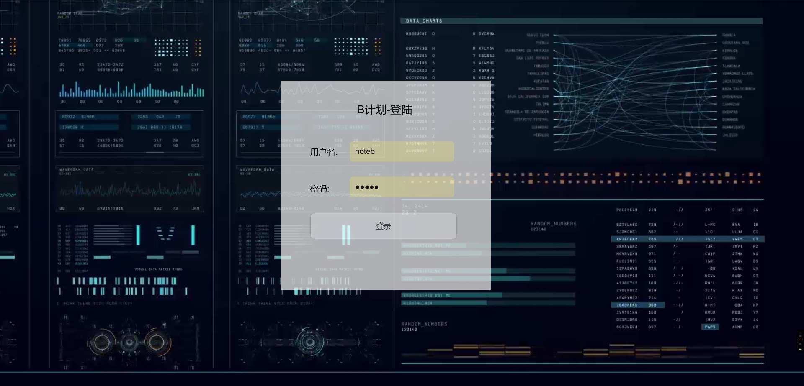
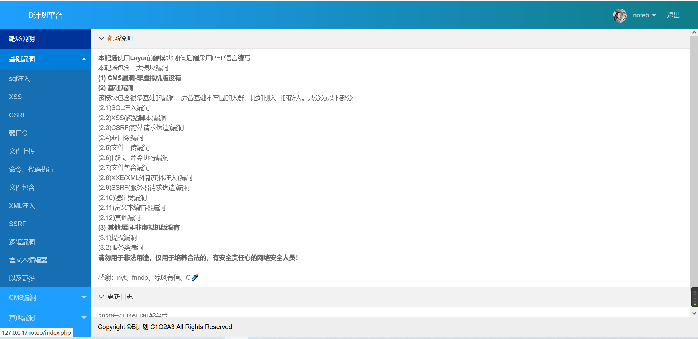
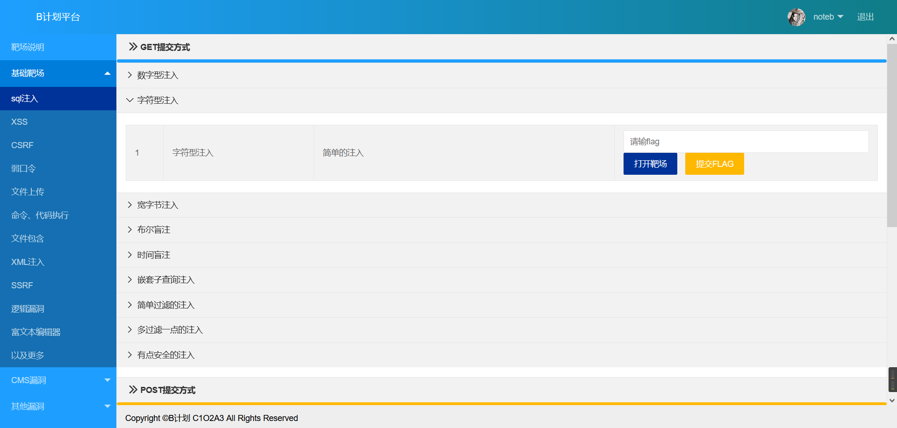
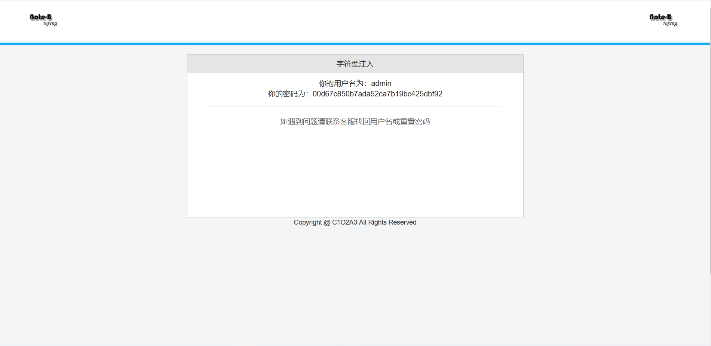
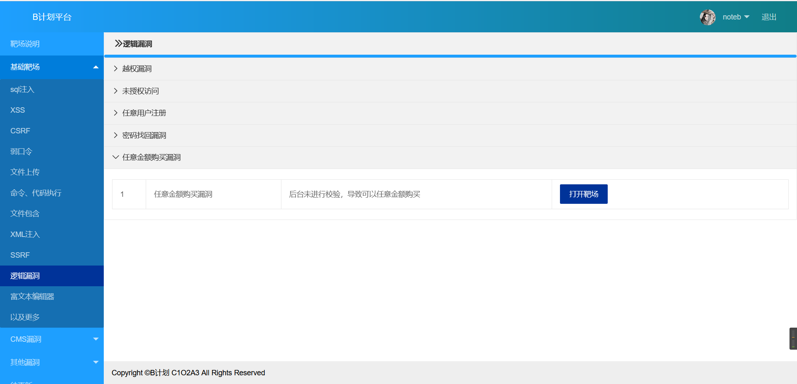
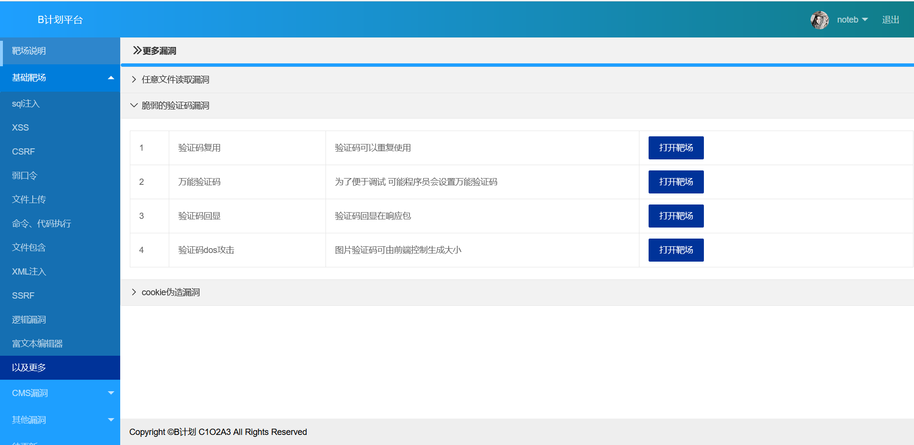
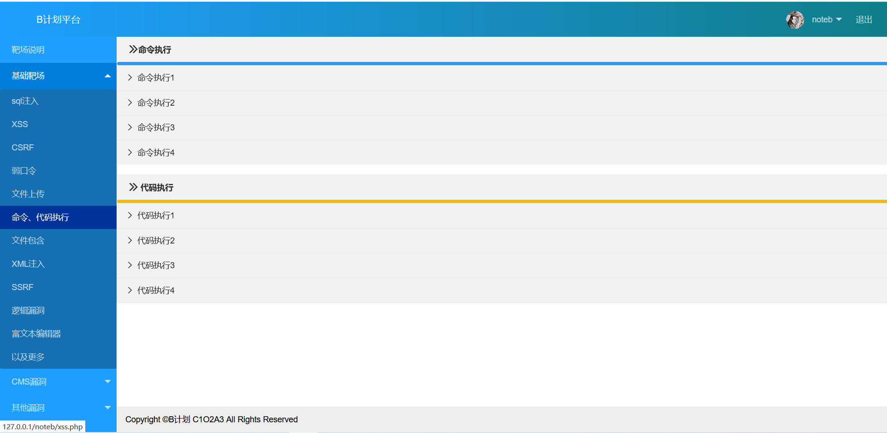
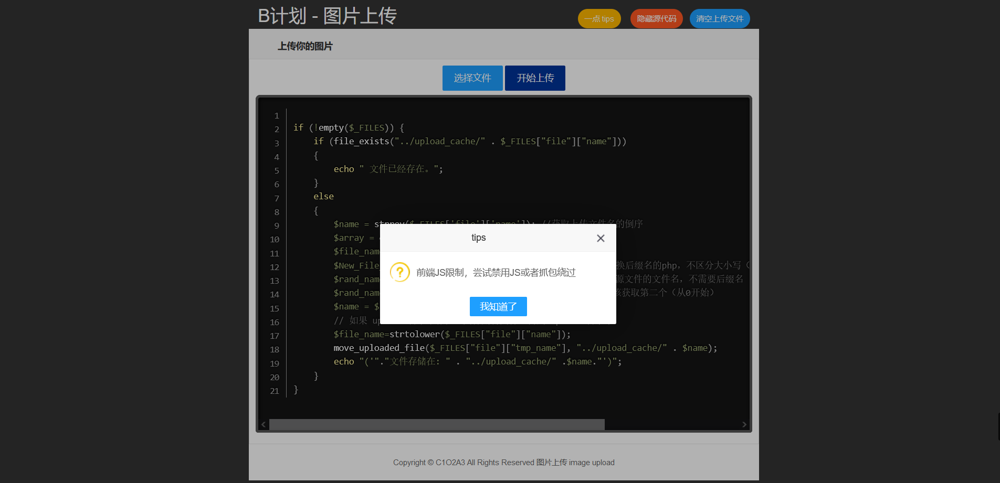

# README

## 0x00 前提

这是我之前的一个毕业作品吧。。。

之前深深的感觉到我的基础漏洞知识太弱，于是想写个靶场增强一下（虽然现在也不咋地，笑）。

靶场参考了很多知名靶场，这个貌似一眼就能看出来。

前端框架使用的是layui

后端是PHP写的

可能会有各种各样的bug

其实2020年就写好了的，但是写完后忽然发现很多用的都是mysql函数写的，于是为了兼容php7，改成了mysqli。。

## 0x01 安装

首先创建**noteb**数据库，导入noteb.sql文件，是的。。文件内容有点大。。。



然后修改Noteb-labs\noteb\vul\sqli\config.php里面的数据库配置文件

就是下面的

```php
//数据库配置文件
//dbuser是数据库用户
//dbpass是数据库用户的密码
//dbname不要动，默认是noteb
//host也不要动，localhost指本地数据库
$dbuser ='root';
$dbpass ='root';
$dbname ="noteb";
$host = '127.0.0.1';
```

根据自己实际需求修改，至此应该安装完毕了

登陆账户密码是noteb:noteb

里面关卡凡是需要登陆账户的要不就是

admin:admin

admin:123456

test:123456
test:test

## 0x02截图

登陆页面



首页



SQL注入页面





逻辑漏洞页面





命令执行页面



文件上传关卡



## 0x03 tips

-   **SQL注入关卡**的步骤都会记录，在log文件夹内
-   部分关卡可以输入?s查看源码，例如**noteb/vul/sqli/sqli1/index.php?s**
-   其他的等我想到先吧。。。。

